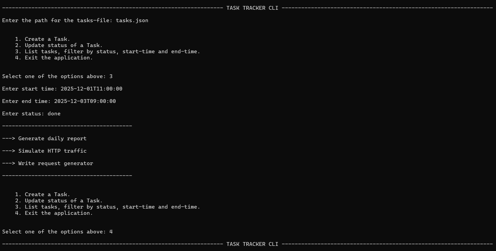

# `Task Tracker CLI`

## What is this project ?
- This project is a CLI application that reads json file and provides functionality to create tasks, update status of a task and list filtered tasks. 

## Features
- `Single Source of Truth for State`
    - All task mutations are centralized in the service layer, interface never mutates state directly.
- `Persistence of changes safely`            
    - No half written files.
- `Invariants Enforcement`             
    - Rules that must always hold true, regardless of input, execution order, or failures.
- `Idempotency Enforcement`                  
    - Running the same operation multiple times does not corrupt or duplicate state.
- `Robust Error Handling`                    
    - Exceptions are raised where invariants are violated and handled at the interface without leaking internal state.
### `CLI`


## What problem it solves ?
- It helps in maintaining and scheduling of tasks by providing functions to manage the status of tasks, adding new tasks, etc.

## What can it do ?
    1. Create a Task.
    2. Update status of a Task.
    3. List tasks, filter by status, start-time and end-time.

## What it intentionally does not include ?
- No databases.
- No frameworks or ORMs.
- The project intentionally avoids abstractions and tooling in order to implement core behaviors manually. The focus is on understanding how correctness, state ownership, invariants, and persistence are enforced at a fundamental level, before delegating those responsibilities to frameworks or databases.

## Folder Structure
    |- main.py          Entry point of the application.
    |- task_service.py  Contains TaskService class that provides methods to interact with json data
    |- utils.py         Utility functions
    |- tasks.json       JSON file containing tasks data

## How to run it ?
### `Requirements`
- Python version >= 3.12.0

### Clone the repo: 

1.
    ```
    git clone https://github.com/ayvkma/task-tracker-cli.git   
    ```
2.  ```python
    python main.py
    ```

## Learnings
- Importance of Invariants.
- Concept of Idempotency.
- Atomic Persistence to disk using replace semantics.
- Function returns should be uniform.
- Thinking from User Perspective, making systems reliable for all sorts of inputs.
- Schema Validation without using any library.
- Failure-first System Design.


